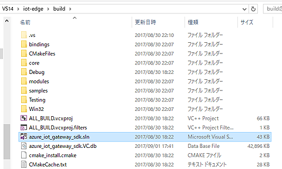
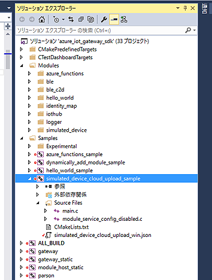
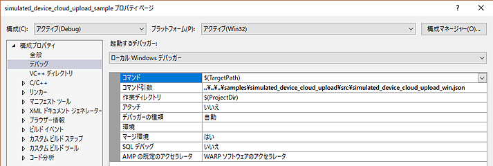

# D2C コンテスト トレーニング情報
[D2C コンテスト](http://www.device2cloud-contest.com/)のトレーニング情報です。随時参考情報を追加していきます。

## IoT Hub のドキュメント
https://docs.microsoft.com/ja-jp/azure/iot-hub/

## Azure Samples ソースコード
GitHub
https://github.com/Azure-Samples

## Azure IoT Hub と物理デバイス入門チュートリアル
https://docs.microsoft.com/ja-jp/azure/iot-hub/iot-hub-get-started-simulated

## Azure IoT Hub 開発者ガイド
https://docs.microsoft.com/ja-jp/azure/iot-hub/iot-hub-devguide

## C 用 Azure IoT device SDK
https://docs.microsoft.com/ja-jp/azure/iot-hub/iot-hub-device-sdk-c-intro

#### GitHub
https://github.com/Azure/azure-iot-sdk-c

### 4種類のデバイスを標準サポート
#### On Linux (Ubuntu 14.04, 15.04, 15.10, 16.04): Device SDK on apt-get
#### On mbed: Device SDK library on MBED
#### On Arduino: Device SDK library in the Arduino IDE
#### On Windows: Device SDK on NuGet

## Azure IoT Hub とシミュレートされたデバイス入門チュートリアル
https://docs.microsoft.com/ja-jp/azure/iot-hub/iot-hub-get-started-simulated

### Raspberry Pi オンライン シミュレーター
簡単！1分間で動作確認できるRaspberry Pi オンライン シミュレーター（実機版もあり）

https://docs.microsoft.com/ja-jp/azure/iot-hub/iot-hub-raspberry-pi-web-simulator-get-started

## Azure iot-edge
https://docs.microsoft.com/ja-jp/azure/iot-hub/iot-hub-iot-edge-overview

### Windows版をシミュレーターで実行
https://docs.microsoft.com/ja-jp/azure/iot-hub/iot-hub-windows-iot-edge-simulated-device

### Linux版をHyper-V上のVMで実行
https://docs.microsoft.com/ja-jp/azure/iot-hub/iot-hub-linux-iot-edge-simulated-device

### Linux版をBash on Windowsで実行
https://docs.microsoft.com/ja-jp/azure/iot-hub/iot-hub-linux-iot-edge-simulated-device

#### Bash on Windowsのインストール：
コントロールパネル→プログラムと機能→Windows機能の有効化→Windows Subsystem for Linux(Beta)

### 簡単改造
前項の温度センサーシミュレーターを実データ入力に簡単改造Jsonファイルにデータ受け渡しファイル名を追記して、\iot-edge\modules\simulated_device\src\simulated_device.cのファイルだけを改造。下記事例参照。

#### GitHub URL
https://github.com/ahidaka/iot-edge-hacks


### Visual Studioを使用したデバッグ
iot-edgeのデバッグはWindows版でVisual Studioを使用する方法が簡単です。
#### 手順１
buildディレクトリ以下にある「azure_iot_gateway_sdk.sln」ファイルをVisual Studioを使用して開きます。このままコンパイル可能です。
注意：Visual Studio 2017だとコンパイル時にエラーになる場合があります。


#### 手順２
Solution Explorerでsimulated_device_cloud_upload_sample を選択してコンパイル、デバッグできます。


#### 手順３
simulated_device_cloud_upload_sampleのプロパティで「デバッグ」設定を開き、起動時に指定するJsonファイルの相対パスを次の通り指定します。
```
..\..\..\samples\simulated_device_cloud_upload\src\simulated_device_cloud_upload_win.json
```


## Cognitive Services 動作環境を選ばない Azure AI API
https://azure.microsoft.com/ja-jp/services/cognitive-services/

### CustomVisionSample
https://github.com/ms-iotkithol-jp/CustomVisionSample
